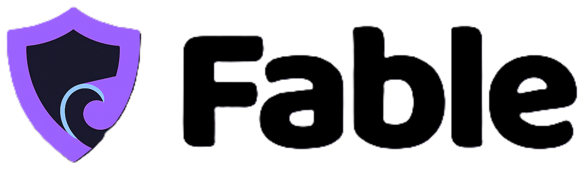

<div align="center">
  <br />
  <picture>
    <source media="(prefers-color-scheme: dark)" srcset="public/images/brand/fable-logo-white.png">
    
  </picture>
  <br />
  <br />

  <p><b>Next-Generation AI Security & Intelligence Infrastructure for African Finance.</b></p>

  <blockquote>
    <i>"Security that disappears when you're safe. Shows up hard when you're not."</i>
  </blockquote>

  <p>
    
    
    
    
    
    
    
  </p>

  <p>
    <a href="#-the-problem">Problem</a> •
    <a href="#-the-fable-solution">Solution</a> •
    <a href="#-the-three-fable-agents">Agents</a> •
    <a href="#-repository-architecture">Architecture</a> •
    <a href="#-local-setup-guide">Setup</a> •
    <a href="#-the-90-second-demo">Demo Guide</a> •
    <a href="#-api-documentation">API Docs</a>
  </p>
</div>

---

<br />

## 🌍 The Problem: The Evolution of Financial Fraud

Every bank's fraud system kicks in *after* the user hits send. By then, the scammer has already won. 

In the modern digital banking era—particularly across emerging African markets like Nigeria—scams no longer happen inside the banking apps themselves. The technological perimeters (2FA, biometric logins, hardware tokens) are generally secure against brute force. Instead, **the human is the vulnerability**.

Scams happen on WhatsApp, phone calls, and cloned websites in the five minutes before the transaction. They manifest as:
- **Social Engineering & Impersonation:** Scammers posing as family members in distress.
- **Deepfake Voice Clones:** AI-generated audio bypassing the "I know their voice" heuristic.
- **Urgency Scripts:** Crafted messages in local dialects (like Nigerian Pidgin) designed to trigger panic and bypass rational thought.
- **Business Email Compromise (BEC):** Fake supplier invoices routing funds to mule accounts.

Because the user themselves is convinced to authorize the transfer, traditional rule-based fraud systems (which only look for credential stuffing or geographic anomalies) fail. They see a legitimate user, on a legitimate device, entering a legitimate OTP. 

To the bank, it looks like a perfect transaction. To the user, it is a catastrophic loss.

<br />

## 🛡 The Fable Solution: Context-Aware Defense

**Fable** is an API-first AI security and intelligence infrastructure layer that sits dynamically between the user and the transaction.

Rather than looking solely at the technical payload, Fable looks at the **context**. While existing platforms focus on *Identity Intelligence* (answering "Is this person who they say they are?"), Fable focuses on **Behavioral Intelligence** (answering "Is this person acting under manipulation or duress?").

It knows each user's genuine behavioral habits so deeply that safe transfers go through with zero friction, while anomalous, suspicious transfers get caught before money leaves the account.

### Why Fable is Different:
1. **Behavioral over Identity:** We assume the user is logged in perfectly. We secure their *intent*, not just their credentials.
2. **Security Without Friction:** Safe users get *fewer* prompts than today, not more.
3. **Context, Not Just Payload:** It reads the "room" (device velocity, recipient age, narration semantics).
4. **Transparency by Design:** Every intervention is explained in plain English. No black-box rejections.
5. **Containment over Cancellation:** When users override warnings, Fable contains the blast radius rather than failing open.

<br />

## 🧠 The Three Fable Agents

Fable doesn't use a monolithic risk engine. It relies on a multi-agent system executing in under `200ms` before the transaction clears the central switch (e.g., NIBSS).

<table>
  <tr>
    <td align="center" width="33%">
      <h3>🤝 Copilot</h3>
      <b>The Personalization Engine</b>
    </td>
    <td align="center" width="33%">
      <h3>⚔️ Shield</h3>
      <b>The Threat Defense</b>
    </td>
    <td align="center" width="33%">
      <h3>👻 Ghost</h3>
      <b>The Containment Layer</b>
    </td>
  </tr>
  <tr>
    <td valign="top">
      <b>Always On, Passive.</b><br/>
      Analyzes historical transactions, trusted channels, and payment hours. Builds a unique mathematical baseline for every user. If a transaction matches the baseline, it is approved silently. Zero friction. <i>Example: Ada paying her landlord on the 1st of the month.</i>
    </td>
    <td valign="top">
      <b>Real-Time Interception.</b><br/>
      Catches social engineering, deepfakes, and channel anomalies. Evaluates payload semantics (e.g., "urgent help abeg" in Pidgin). When it blocks a transaction, GPT-4o generates a plain-English explanation without blaming the user.
    </td>
    <td valign="top">
      <b>Blast-Radius Containment.</b><br/>
      If a user overrides a Shield block, Ghost holds the funds in an isolated Smart Container for a 15-minute cooling window. The scammer gets nothing. Once the adrenaline wears off, the user can cancel safely.
    </td>
  </tr>
</table>

### Agent Deep-Dive: Shield Signal Layers
When a transaction is analyzed, Shield computes a risk score (0.0 to 1.0) using multiple concurrent signal layers:
- **Transaction Anomalies:** Is this amount 10x higher than their 90-day average?
- **Identity Signals:** Is the recipient a newly created account?
- **Social Engineering Context:** Does the narration match our JSON-backed Nigerian Scam Pattern library?
- **Network Intelligence:** Has this recipient been flagged across the Fable network?
- **Channel Weights:** Was this initiated via a high-risk channel like USSD?

<br />

## 🏗 Repository Architecture

Fable is structured as a powerful monorepo containing a high-performance Python AI backend and a Next.js full-stack frontend.

```text
fable/
├── api/                           # 🧠 FastAPI Python Backend (Intelligence Layer)
│   ├── agents/                    # Core Agent Logic
│   │   ├── copilot/               # Baseline profiling
│   │   ├── ghost/                 # Account containment holds
│   │   ├── shield/                # Real-time risk scoring
│   │   └── watch/                 # Passive continuous monitoring
│   ├── intelligence/              # Fraud graphs and scam pattern JSONs
│   ├── middleware/                # Rate limiting, auth, latency tracking
│   ├── main.py                    # Uvicorn entry point
│   ├── db.py                      # SQLite database connector
│   └── requirements.txt           # Python dependencies
│
├── prisma/                        # 🗄️ Database ORM Layer (Next.js)
│   ├── schema.prisma              # Data models (Institution, User, Transaction)
│   └── seed.ts                    # DB seeding scripts
│
├── src/                           # 💻 Next.js 16 Frontend (Platform)
│   ├── app/
│   │   ├── (marketing)/           # Public landing site
│   │   ├── dashboard/             # B2B Institution console
│   │   └── demo/                  # Mobile-first banking app simulation
│   ├── components/                # Reusable UI (Tailwind, Framer Motion)
│   ├── lib/                       # Fable client SDKs and utils
│   └── globals.css                # Global styling
│
└── public/                        # Static assets & Brand Logos
```

### The Technology Stack
- **Backend API:** Python 3.12, FastAPI, SQLite
- **AI Integration:** OpenAI GPT-4o (Explainability), Scikit-learn (Isolation Forests), Gemini Vision (Document Analysis)
- **Frontend App:** Next.js 16 (App Router), React 19, TailwindCSS v4
- **UI Components:** Phosphor Icons, Radix UI primitives, Framer Motion, Sonner
- **Database (Frontend):** Prisma ORM with `better-sqlite3` native bindings

<br />

## 🚀 Local Setup Guide

Spin up the entire Fable ecosystem locally with just a few commands. The system is designed to run locally with minimal friction for development and testing.

### Prerequisites
- Node.js 20+
- Python 3.12+
- `pnpm` or `npm`
- An OpenAI API Key (Required for Shield explanations)

### 1. Start the Intelligence API (Backend)
The backend runs on port `8010` and handles all AI logic.

```bash
# Navigate to the API directory
cd api

# Create and activate a virtual environment
python -m venv .venv
source .venv/bin/activate  # On Windows: .venv\Scripts\activate

# Install dependencies
pip install -r requirements.txt

# Setup Environment Variables
cp .env.example .env
# Edit .env and add your OPENAI_API_KEY

# Run the server
uvicorn main:app --port 8010 --reload
```
*📚 Interactive API Documentation is automatically generated and available at: `http://localhost:8010/docs`*

### 2. Start the Fable Platform (Frontend)
The Next.js frontend runs on port `3000` and hosts the Demo Bank and Dashboard.

```bash
# In a new terminal window at the repository root
npm install

# Initialize the Prisma SQLite database
npm run db:setup

# Setup Environment Variables
cp .env.local.example .env.local
# Edit .env.local if you changed the backend port, default is http://localhost:8010

# Start the development server
npm run dev
```
*🌐 The Platform is now available at: `http://localhost:3000`*

<br />

## 🎮 The 90-Second Demo

Want to see Fable in action? We built a simulated mobile-first banking app right into the platform. Open `http://localhost:3000/demo` and follow these precise cheat codes:

### ✅ Scenario 1: Normal Transfer (PASS)
*Testing Fable Copilot's ability to remove friction for genuine transactions.*
1. On the demo app home screen, tap **Transfer**.
2. **Select Recipient:** Choose a known contact like `Mum`, `Landlord`, or `Chioma`.
3. **Amount:** Keep it typical (e.g., `₦10,000`).
4. **Narration:** `food money`
5. **Tap:** `Analyze & Send`
6. **Result:** Copilot clears it silently. You will see an instant green flash. The risk score is extremely low (e.g., `0.04`). Security disappears when you're safe.

### 🚨 Scenario 2: Suspicious Transfer (BLOCK)
*Testing Fable Shield's ability to intercept social engineering in real-time.*
1. Go back and initiate a new **Transfer**.
2. **Select Recipient:** Choose `Unknown Contact`.
3. **Amount:** Make it anomalous (e.g., `₦500,000`).
4. **Narration:** Enter the exact phrase: `urgent help abeg` (This triggers the Pidgin scam pattern detection).
5. **Channel:** Change to `USSD`.
6. **Tap:** `Analyze & Send`
7. **Result:** Shield intercepts the transaction instantly. The risk score spikes to `0.94`. An interactive UI appears explaining *exactly* why it was blocked using GPT-4o (amount anomaly, new recipient, urgency keyword detected).

### 🛡️ Scenario 3: User Overrides (GHOST)
*Testing Fable Ghost's containment layer when users ignore warnings.*
1. On the blocked screen from Scenario 2, locate the secondary button.
2. **Tap:** `Send Anyway → Ghost Protection`
3. **Result:** The funds are not sent to the scammer. Instead, they are routed to an isolated `GhostContainer` in the database. A 15-minute real-time countdown begins.
4. During this window, you can safely tap **Cancel & Get Money Back**.

<br />

## 📖 API Documentation (Overview)

Fable is built API-first. Institutions integrate Fable by calling our REST endpoints before allowing a transaction to process.

### `POST /v1/shield/analyze`
The core interception endpoint. Evaluates a transaction payload and returns an action.

**Request Payload:**
```json
{
  "user_id": "usr_12345",
  "transaction": {
    "amount": 500000,
    "currency": "NGN",
    "recipient_account": "0123456789",
    "recipient_bank": "Zenith",
    "narration": "urgent help abeg",
    "channel": "mobile_app"
  },
  "device": {
    "fingerprint": "fp_abc123"
  }
}
```

**Response Payload:**
```json
{
  "risk_score": 0.94,
  "risk_level": "HIGH",
  "action": "BLOCK",
  "signals": [
    "amount_anomaly: 8x above user baseline",
    "new_recipient: first transaction to this account",
    "scam_pattern: urgency keyword detected"
  ],
  "explanation": "This transfer was flagged because the amount is 8 times larger than your usual transfers, the recipient is someone you have never paid before, and the note matches patterns common in Nigerian social engineering scams.",
  "agent": "fable-shield-v1"
}
```

### Other Key Endpoints
- `POST /v1/ghost/create` - Initializes a ghost container for a blocked transaction.
- `POST /v1/ghost/{id}/cancel` - Refunds the held money back to the user.
- `POST /v1/ghost/{id}/confirm` - Releases the held money to the recipient.
- `GET /v1/copilot/transparency/{user_id}` - Returns everything Fable knows about the user's baseline.

<br />

## 📊 Database Schema (Prisma)

The Next.js application uses Prisma to model the institution data, customers, and transactions. 

```prisma
model Transaction {
  id               String   @id @default(cuid())
  amount           Float
  currency         String   @default("NGN")
  direction        String   @default("debit")
  channel          String   @default("app")
  narration        String   @default("")
  customerName     String
  recipientName    String
  recipientBank    String
  recipientAccount String
  status           String   @default("completed") // completed | blocked | cancelled | held | released
  live             Boolean  @default(false)
  createdAt        DateTime @default(now())

  institution   Institution @relation(fields: [institutionId], references: [id])
  institutionId String
  user          User?       @relation(fields: [userId], references: [id])
  userId        String?

  evaluation RiskEvaluation?
  ghost      GhostContainer?
}
```
Every transaction is inherently tied to a `RiskEvaluation` (if analyzed by Shield) and optionally a `GhostContainer` (if overridden).

<br />

## 🤝 Contribution Guidelines

We welcome contributions to Fable! If you're interested in improving the African Fintech Security landscape:
1. Fork the repository.
2. Create a feature branch: `git checkout -b feature/new-scam-pattern`.
3. Add tests for your logic (especially for API agents).
4. Ensure the Next.js build passes: `npm run build`.
5. Submit a Pull Request.

<br />

---

<div align="center">
  <h3>🏆 Built for HackX 6.0 × Union Bank</h3>
  <p>Fable was designed, architected, and built from scratch during an intense 7-day sprint for the ECX HackX 6.0 Hackathon.</p>
  <p><b>Team Fable:</b></p>
  <p>
    <b>Kenzy</b> (Lead Engineer) •  
    <b>Natty / Conqueror909</b> (Backend Engineer) •  
    <b>Blessing / Katalysttt</b> (Frontend Engineer & Product)
  </p>
  <br />
  <p><i>Trust by receipts, not promises.</i></p>
</div>
