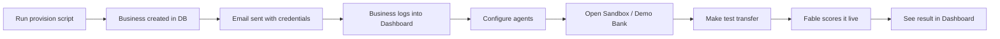

# Fable B2B Onboarding & Demo Flow

## The Problem
Fable is a **B2B finance infrastructure** product — there's no self-serve "Sign Up" button. Businesses (banks, fintechs, wallets) are provisioned by Fable, not by themselves. We need a clean flow for:
1. Creating a business on the platform
2. Giving them dashboard access
3. Letting them test with the demo bank (critical for hackathon pitch day)

> [!IMPORTANT]
> **Fable is invisible infrastructure.** The end-user (bank customer) never sees Fable branding, scoring UI, shield animations, or risk scores. The demo bank layer must be zero-friction — transfers simply get silently approved, flagged, or blocked. All monitoring, management, and visibility lives exclusively in the institution admin dashboard/console.

---

## URL Strategy

> [!IMPORTANT]
> **No hardcoded URLs anywhere.** All URLs across the app, backend, email templates, and scripts must be dynamic — either auto-detected from the current request origin or pulled from environment variables.

```env
# api/.env
APP_BASE_URL=           # e.g. http://localhost:3000 in dev, https://fable.ng in prod
DASHBOARD_BASE_URL=     # e.g. ${APP_BASE_URL}/dashboard
DEMO_BANK_BASE_URL=     # e.g. ${APP_BASE_URL}/demo
API_BASE_URL=           # e.g. http://localhost:8000 in dev, https://api.fable.ng in prod
```

In email templates and scripts, URLs are constructed dynamically:
- `{APP_BASE_URL}/dashboard/login` instead of `https://console.fable.ng`
- `{API_BASE_URL}/v1/score` instead of `https://api.fable.ng/v1/score`
- In the Next.js frontend, use `window.location.origin` or Next.js headers to detect the current host

---

## Proposed Architecture

### 1. Business Provisioning (CLI Script)

A Fable admin runs a script to create a new business:

```bash
python scripts/provision.py \
  --name "Meridian Microfinance Bank" \
  --type "microfinance_bank" \
  --contact-email "cto@meridian.ng" \
  --agents copilot,shield,ghost
```

**What the script does:**
- Creates the institution record in the FastAPI backend database
- Generates API credentials (`fbl_live_xxxx` secret key)
- Generates a webhook signing secret
- Creates an admin user with a random secure password
- Provisions default agent configs (Copilot always on, others per plan)
- Sends a welcome email with login credentials

### 2. Credential Delivery (Email)

The business receives an email with:
- Dashboard URL: `{APP_BASE_URL}/dashboard` (from env)
- Login email (their business email)
- Temporary password (must change on first login)
- API key (masked, full key visible in dashboard)
- API endpoint: `{API_BASE_URL}/v1/score` (from env)
- Link to API docs: `{APP_BASE_URL}/platform` (from env)

### 3. Dashboard Access

Business logs in → sees their institution dashboard:
- Configure agents (toggle Shield, Ghost, Watch)
- View API key & webhook endpoint
- View transaction stream (empty until integrated)
- Settings & billing

### 4. Demo Bank Integration — **The Key Question**

> [!IMPORTANT]
> For hackathon pitch day, the judges need to SEE a live transfer get scored. How does a business connect to the demo bank to test?

Here are the options:

---

#### Option A: Demo Bank is Built Into the Dashboard (Recommended)

The demo bank is a **sandbox environment** built into every Fable dashboard. When a business is provisioned, they automatically get:

- A "Sandbox" tab/section in their dashboard
- Pre-seeded test accounts (Alice, Bob, Charlie — same as current demo bank)
- Ability to make test transfers that flow through their configured agents
- The demo bank UI is accessible at `/dashboard/sandbox` or `/demo`

**Pitch day flow:**
1. Show the marketing site → explain the problem
2. Log into the dashboard → show the agent configs
3. Go to Sandbox → make a live transfer → watch it get scored in real-time
4. Switch back to dashboard → show the transaction in the live stream

**Pros:** Self-contained, no separate login, judges see everything in one flow
**Cons:** Demo bank is tied to the dashboard

---

#### Option B: Demo Bank Has Its Own Login (Per-Business)

Each business gets their own demo bank instance with its own login:
- Business admin creates "test customers" from the dashboard console
- Each test customer gets credentials to log into the demo bank
- Demo bank URL: `{APP_BASE_URL}/demo/{institution-slug}`

**Pitch day flow:**
1. Marketing site → explain problem
2. Dashboard login → show configs
3. Open demo bank in new tab → log in as test customer → make transfer
4. Switch to dashboard → see the transaction scored

**Pros:** More realistic simulation of a real integration
**Cons:** Extra login step, more complexity

---

#### Option C: Business Creates Bank Accounts from Console

The dashboard has a "Test Accounts" section where the business can:
- Create virtual bank accounts (name, initial balance)
- Generate account numbers
- Use these accounts in the demo bank without a separate login
- Demo bank is accessed via a direct link with a session token

**Pitch day flow:**
1. Dashboard → create 2 test accounts
2. Click "Open Demo Bank" → auto-logged in
3. Make a transfer → scored live
4. Back to dashboard → see results

**Pros:** Maximum control, very clean demo flow
**Cons:** More to build

---

## Recommendation for Hackathon

> [!TIP]
> **Go with Option A (Demo Bank built into Dashboard)** for the hackathon. It's the simplest to build and demo. The sandbox is just another section in the dashboard — no extra logins, no extra URLs, no confusion for judges.

**For the actual production product later**, Option B or C makes more sense for real customers who want to test with their own data.

### Minimal Hackathon Flow:



## Open Questions

1. **Which option do you prefer?** A, B, or C?
2. **Should the provision script be a FastAPI admin endpoint** instead of a CLI script? (e.g., `POST /admin/provision`)
3. **Do we need multiple user roles** per institution (admin vs. viewer) for the hackathon, or is single admin enough?
